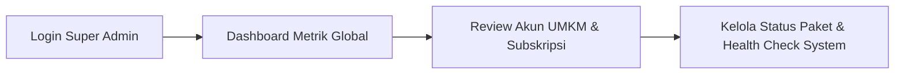
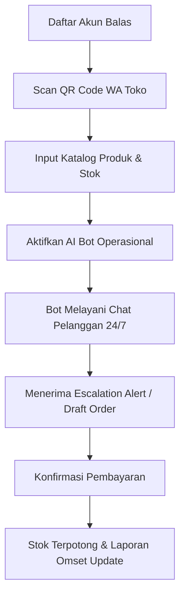
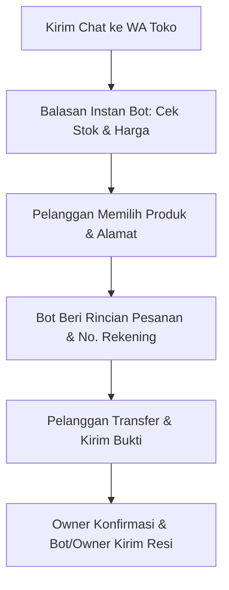

# 🎯 PLANNING PRODUK SAAS "BALAS"
> **Otomatisasi WhatsApp Chat & Asisten Operasional Mikro (Pesanan, Stok, & Laporan Keuangan) untuk UMKM Indonesia**

---

## 1. 🚀 Ringkasan Produk (Elevator Pitch)
**Balas** adalah platform SaaS *all-in-one* yang menggabungkan asisten AI percakapan WhatsApp dengan sistem manajemen operasional mikro (pesanan, stok, dan laporan keuangan harian) untuk UMKM mikro di Indonesia. Berbeda dari solusi chatbot mahal yang rumit dan sekadar membalas pesan, **Balas** bekerja layaknya "karyawan otomatis 24/7" yang ramah—ia melayani tanya-jawab pelanggan via WhatsApp, mengecek ketersediaan stok, otomatis mencatat pesanan, serta mengkalkulasi laporan pendapatan harian pemilik usaha. Sistem secara cerdas mengetahui kapan percakapan perlu dialihkan (*escalate*) ke pemilik toko—seperti saat terjadi nego harga, konfirmasi pembayaran manual, atau komplain pelanggan—sehingga pemilik usaha dapat fokus tumbuh tanpa kehilangan kendali bisnis.

---

## 2. 👤 Target User Persona (Pengguna Awal / Early Adopters)

### **Persona Utama: "Mbak Rani" (Owner Toko Online Rumahan / Reseller Fashion & Kuliner)**
- **Demografi & Profil:** Wanita/Pria usia 22–40 tahun, pemilik toko online kuliner rumahan (PO makanan, frozen food) atau reseller baju/kosmetik di Instagram, TikTok Shop, & Shopee.
- **Skala Bisnis:** Omset Rp 5 juta – Rp 50 juta/bulan, memiliki 10–50 transaksi per hari, mengelola usaha sendiri atau dibantu 1 admin.
- **Pain Points Utama:**
  1. **Kewalahan Balas Chat WA:** Pesan menumpuk di jam sibuk atau malam hari; pembeli berpaling ke toko lain jika lambat dibalas.
  2. **Pencatatan Manual Berantakan:** Pesan disalin manual ke buku catatan/Excel; sering salah catat barang, lupa potong stok, atau terjadi *overselling*.
  3. **Biaya Kompetitor Sangat Mahal:** Sistem seperti Qiscus/WATI mematok harga jutaan rupiah/bulan dengan biaya API WhatsApp official per pesan yang membingungkan.
  4. **Setup Terlalu Rumit:** Tidak punya kapasitas teknis untuk setup *flowchart* atau *webhook* rumit.
- **Willingness to Pay:** Siap membayar paket terjangkau (Rp 99.000 – Rp 199.000 / bulan) jika terbukti menghemat jam kerja dan mencegah pesanan lepas.

---

## 3. 📦 Daftar Fitur MVP vs Fitur Fase 2

### 🌟 **Fitur MVP (Minimum Viable Product - Fokus Rilis Cepat & Fungsional)**
1. **WhatsApp AI Bot & Live Escalation:**
   - Integrasi koneksi WA via Scan QR Code.
   - Prompt AI yang dilatih dengan info toko, katalog produk, FAQ, dan aturan toko.
   - *Escalation Engine*: Bot otomatis menandai chat yang butuh penanganan manusia (misal: intent transfer/bayar, komplain, nego) dan memberi notifikasi ke pemilik usaha.
2. **Katalog Produk & Stok Sederhana:**
   - CRUD Produk (Nama, Foto, Harga, Stok saat ini, Deskripsi singkat).
   - Pemotongan stok otomatis saat pesanan dikonfirmasi/dicatat oleh bot.
3. **Pencatatan Pesanan Otomatis (Order Management):**
   - Bot mendeteksi niat beli dan menyusun *Draft Order* (Nama Pelanggan, No WA, Produk, Jumlah, Total Harga, Alamat Kirim).
   - Pemilik toko tinggal meng-klik 1 tombol "Konfirmasi Lunas" / "Proses Kirim".
4. **Dashboard Financial & Operational Ringkas:**
   - Ringkasan Pendapatan Harian, Mingguan, dan Bulanan.
   - Rekap transaksi lunas vs pending.
   - Peringatan stok hampir habis (*low stock alert*).
5. **Multi-Tenant System (Platform Level):**
   - Registrasi & Autentikasi Pemilik UMKM.
   - Isolation data antar toko/tenant.

### 🔮 **Fitur Ditunda ke Fase 2 (Future Roadmap)**
- Integrasi Payment Gateway Automatic (Xendit/Midtrans/QRIS Otomatis).
- Integrasi Kurir/Ongkir Otomatis (Biteship/RajaOngkir/Paxel).
- WhatsApp Official Business API (BSP Integration: 360dialog/Meta).
- Broadcast Promo / WhatsApp Marketing Blast Engine.
- Multi-Admin / Multi-Agent Live Chat Inbox di Dashboard.
- Export Laporan Keuangan ke format PDF / Excel / Accounting App.

---

## 4. 🏢 Struktur 3 Lapis Pengguna (User Hierarchy)

| Lapis Pengguna | Hak Akses & Peran Utama | Lingkungan Interaksi |
| :--- | :--- | :--- |
| **1. Platform Owner** *(Super Admin / Saya)* | Pantau metrik kesehatan platform, kelola akun UMKM berlangganan, atur paket harga, dan pantau penggunaan API AI. | Web Admin Panel (`/admin`) |
| **2. Business Owner** *(Pemilik UMKM)* | Setup WA via QR code, kelola katalog produk & stok, terima notifikasi *escalation*, konfirmasi pesanan, dan lihat laporan keuangan. | Web Dashboard App (`/dashboard`) |
| **3. End Customer** *(Pembeli UMKM)* | **TIDAK PUNYA AKSES KE SISTEM/DASHBOARD.** Hanya melakukan interaksi jual-beli via WhatsApp biasa. | Aplikasi WhatsApp Client |

---

## 5. 🔄 User Flow Singkat (3 Lapis Pengguna)

### **Flow 1: Platform Owner (Kelola Platform & Tenant)**

1. Super Admin login ke panel khusus `/admin`.
2. Memantau statistik kesehatan sistem, total UMKM aktif, volume transaksi, dan penggunaan token AI.
3. Mengatur status langganan UMKM (misal memberikan masa trial 14 hari atau mengaktifkan paket berbayar).

---

### **Flow 2: Business Owner (Setup Awal s.d. Dapat Manfaat)**

1. Pemilik UMKM mendaftar di **Balas**, lalu mengoneksikan nomor WhatsApp toko dengan scan QR Code di layar.
2. Memasukkan data produk (nama, harga, stok) dan aturan toko (jam kerja, no. rekening transfer).
3. Bot aktif bekerja. Saat ada chat masuk, bot melayani pembeli, mengecek stok, dan menyusun *Draft Order*.
4. Ketika pembeli siap bayar atau minta diskon, bot memberi tahu pemilik usaha. Pemilik mengonfirmasi pembayaran dan mengeklik "Lunas". System otomatis memotong stok dan meng-update laporan omset harian.

---

### **Flow 3: End Customer (Pengalaman Berbelanja via WhatsApp)**

1. **Pembeli:** *"Halo Kak, apakah Frozen Beef Teriyaki masih ada stok?"*
2. **Bot Balas:** *"Halo Kak! Masih ada 5 pack. Harganya Rp 45.000/pack. Mau pesan berapa pack Kak?"*
3. **Pembeli:** *"Pesan 2 pack ya, kirim ke Jl. Melati No. 10 Jakarta"*.
4. **Bot Balas:** *"Baik Kak! Total 2 pack = Rp 90.000. Silakan transfer ke BCA 12345678 a.n Toko Rani. Setelah transfer kirim buktinya ke sini ya Kak 😊"*. *(Sekaligus membuatkan draft order di dashboard pemilik).*
5. **Pembeli:** Kirim bukti transfer ➔ Pemilik Toko klik "Konfirmasi Lunas" di dashboard ➔ Pesanan diproses!

---

## 6. 🛠️ Rekomendasi Tech Stack MVP (Ringan, Cepat, & Scalable)

1. **Frontend / Web Dashboard:**
   - **Framework:** Next.js (React / TypeScript) + Vanilla CSS / Tailwind CSS.
   - **Alasan:** Next.js memfasilitasi pembuatan Landing Page yang SEO-friendly sekaligus Web Dashboard SPA yang cepat, efisien, dan modern.

2. **Backend & API Engine:**
   - **Framework:** Node.js dengan Next.js App Router API Routes / Fastify.
   - **Alasan:** Node.js sangat unggul dalam menangani I/O *asynchronous* dan event-driven chat WhatsApp berkecepatan tinggi.

3. **WhatsApp Gateway Engine:**
   - **Library:** `@whiskeysockets/baileys` (atau `whatsapp-web.js`).
   - **Alasan:** Bebas biaya transaksi per pesan (sangat cocok untuk MVP & UMKM mikro), ringan, mendukung scan QR code multi-device, dan mudah terhubung via WebSocket.

4. **AI & NLP Engine:**
   - **API Provider:** OpenAI API (`gpt-4o-mini`) dengan Structured JSON Outputs / Function Calling.
   - **Alasan:** Biaya sangat murah ($0.15/1M input tokens), respons sangat cepat, dan akurasi tinggi dalam mengekstrak data pesanan dari chat pengguna.

5. **Database & ORM:**
   - **Database:** PostgreSQL (via Supabase atau Neon/Local Postgres).
   - **ORM:** Prisma ORM.
   - **Alasan:** Relational DB menjamin konsistensi data keuangan dan stok (ACID compliance). Prisma memberikan pengalaman pengkodean TypeScript yang aman (*type-safe*).

6. **Authentication:**
   - **Library:** NextAuth.js / Supabase Auth.
   - **Alasan:** Siap pakai untuk autentikasi Email/Password dan Google Social Login dengan manajemen sesi yang aman.

---

## 7. 🛍️ Analisis Fleksibilitas & Kategori Bisnis Potensial

### **Apakah hanya untuk satu jenis persona?**
**TIDAK.** Platform **Balas** dirancang secara generik & modular berbasis data (Produk, Harga, Stok, FAQ Custom Toko). Persona "Mbak Rani" di awal hanyalah *niche awal* (beachhead market) untuk mempermudah validasi MVP. Apabila data toko diubah, AI bot Balas akan langsung beradaptasi melayani jenis bisnis lain secara otomatis.

---

### 🏪 **Daftar Kategori Bisnis yang Bisa Menggunakan Balas:**
1. **Kuliner & F&B (PO & Frozen Food):** PO Makanan Rumahan, Catering Harian, Toko Kue/Roti, Frozen Food.
2. **Ritel & Fashion (Online Shop):** Reseller/Dropshipper Baju, Kosmetik/Skincare, Sepatu, Aksesoris HP, Tas.
3. **Grosir Mikro & Supplier Bahan Baku:** Agen Telur, Toko Plastik/Kemasan, Distributor Sembako Mikro.
4. **Jasa dengan Penjadwalan (Booking):** Barber/Salon, Laundry Kiloan, Cuci Mobil/Motor, Service AC/HP, Rental Kamera/Mobil.
5. **Jasa Profesional & Edukasi Mikro:** Bimbel/Kursus Rumahan, Jasa Desain/Print, Penjual Tiket Event Mikro.

---

### 🔥 **Niche Bisnis dengan POTENSI PALING LAKU (High Conversion / Willingness to Pay Tinggi):**

#### 🥇 **1. PO Kuliner Rumahan & Catering / Frozen Food**
- **Mengapa Paling Laku:** Pesanan masuk menumpuk bersamaan di jam-jam tertentu (pagi/sebelum jam makan). Pelanggan butuh jawaban instan mengenai ketersediaan menu hari ini & slot pengiriman.
- **Dampak Balas:** Bot langsung mencatat menu + varian + alamat kirim secara simultan tanpa ada pesanan terlewat.

#### 🥈 **2. Reseller / Toko Online Fashion & Skincare (Social Commerce)**
- **Mengapa Paling Laku:** Pertanyaan calon pembeli sangat berulang: *"Kak warna ini ready? L harganya berapa? Kirim dari mana?"*. Jika tidak dibalas < 3 menit, pembeli langsung berpaling ke toko lain.
- **Dampak Balas:** Respon 2 detik 24/7 menjaga pembeli tidak kabur, dan stok langsung terpotong akurat.

#### 🥉 **3. Jasa Penjadwalan & Laundry Kiloan / Service**
- **Mengapa Paling Laku:** Pelanggan ingin tahu daftar harga (price list) dan memesan slot penjemputan/pengerjaan.
- **Dampak Balas:** Bot mengirimkan pricelist lengkap dan mencatat tanggal/jam *booking* secara otomatis.

#### 4️⃣ **4. Supplier / Distributor Sembako & Bahan Baku Mikro**
- **Mengapa Paling Laku:** Pembeli adalah langganan (*repeat order*) yang memesan barang berkala via WA.
- **Dampak Balas:** Mempercepat proses rekap pesanan grosir harian yang tadinya harus diisi admin satu per satu.
